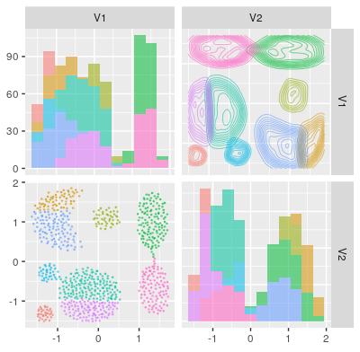
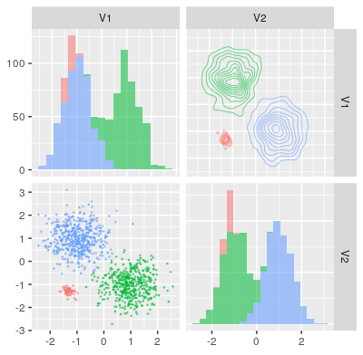
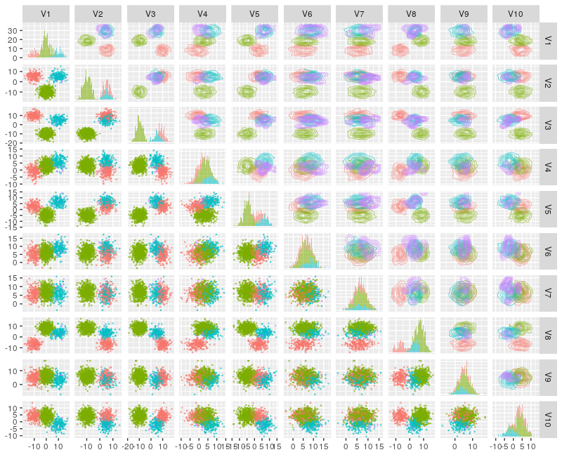

# CRPClustering: An R Package for Bayesian Nonparametric Chinese Restaurant Process Clustering with Entropy 
  
[](http://cran.r-project.org/package=CRPClustering)
[](http://cran.rstudio.com/web/packages/CRPClustering/index.html)

## NEWS  
1.4 (2020-04-12)  
  * Implemented by Rcpp. We changed main methods.  
  * "mu_0" and "sigma_table" and "ro_0" arguments were deleted in "crp_train" method.  
  * "data" argument of a matrix type was changed into data.frame type in "crp_train" method.  
  * return value in "crp_train" method was changed.  
  * A logical type "plot" argument in order to plot clustering result was added in "crp_train" method.   
  * "crp_plot_z" method was added.  
  
1.3 (2018-08-01)  
  * Implemented by Scala. We changed main methods.  
  

## Abstract
Clustering is a scientific method which finds the clusters of data and many related methods are traditionally researched. Bayesian nonparametrics is statistics which can treat models having infinite parameters. Chinese restaurant process is used in order to compose Dirichlet process. The clustering which uses Chinese restaurant process does not need to decide the number of clusters in advance. This algorithm automatically adjusts it. Then, this package can calculate clusters in addition to entropy as the ambiguity of clusters.

## Introduction
Clustering is an analytical method in order to find the clusters of data and many related methods are proposed. K-means[1] and Hierarchical clustering[2] are famous algorithmic methods. Density-based clustering[3] is the method that finds clusters by calculating a concentration of data. In statistical methods, there are stochastic ways such as bayesian clustering[4]. However these methods need to decide the number of clusters in advance. Therefore if the data is both high dimensions and a complex, deciding the accurate number of clusters is difficult. Bayesian nonparametric method[5] composes infinite parameters by Dirichlet process[6]. Dirichlet process is the infinite dimensional discrete distribution that is composed by Stocastic processes like a chinese restaurant process (CRP)[7] or stick-breaking process[8]. CRP does not need to decide the number of clusters in advance. This algorithm automatically adjusts it. We implement the CRP Clustering and the method which calculates the entropy[9] into R package. Then, we explain the clustering model and how to use it in detail and execute simulation by example datasets.

## Background
### Chinese Restaurant Process
Chinese restaurant process is a metaphor looks like customers sit at a table in Chinese restaurant. All customers except for x_i have already sat at finite tables. A new customer x_i will sit at either a table which other customers have already sat at or a new table. A new customer tends to sit at a table which has the number of customers more than other tables. A probability equation is given by    


where n^i_k denotes the number of the customers at a table k except for i and α is a concentration parameter.

### Markov Chain Monte Carlo Methods for Clustering
Markov chain Monte Carlo (MCMC) methods[10] are algorithmic methods to sample from posterior distributions. If conditional posterior distributions are given by models, it is the best way in order to acquire parameters from posterior distributions. The algorithm for this package is given by  

i) ii) iterations continue on below:  

i) Sampling z_i for each i (i = 1,2, ・・・,n)


where k is a k th cluster and i is a i th data. μ new and Σ new are calculated from all data.

ii) Calculating parameters for each k (k = 1,2, ・・・,∞)


Iterations i) ii) continue by iteration number, and Σ k is a variance-covariance matrix of kth cluster. Cov is covariance. i and j are rows and columns’ number of Σ k ij and Σ new ij . First several durations of iterations which are called as burn_in are error ranges. For that reason, burn_in durations are abandoned.

### Clusters Entropy
Entropy denotes the ambiguity of clustering. As a result of a simulation, data x_i joins in a particular table. From the total numbers n_k of the particular table k at the last iteration, a probability p_k at each cluster k is calculated. The entropy equation is given by


## Installation
CRPClustering is available through GitHub (https://github.com/jirotubuyaki/CRPClustering) or CRAN (https://CRAN.R-project.org/package=CRPClustering). If download from GitHub, you can use devtools by the commands:

```
> library(devtools)
> install_github("jirotubuyaki/CRPClustering")
```

Once the packages are installed, it needs to be made accessible to the current R session by the commands:

```
> library(CRPClustering)
```

For online help facilities or the details of a particular command (such as the function crp_train) you can type:

```
> help(package="CRPClustering")
```

## Methods

### Implemented by C++ using GNU Scientific Library

This package is implemented by C++. Please install GNU Scientific Library. Programs are compiled. If you are interested in source codes by R and C++. Please read src directory.

### Method for Chinese Restaurant Process Clustering  

```
> result <- crp_train (data ,
                       alpha =1 ,
                       burn_in =100 ,
                       iteration =1000
                       plot = TRUE
                      )
```

This method calculates CRP clustering.  
Let arguments be:  
  ・ data : a data.frame of data for clustering. row is each data i and column is dimensions of each data i.  
  ・ alpha : a numeric of a CRP concentration rate.  
  ・ burn_in : an iteration integer of burn in.  
  ・ iteration : an iteration integer.  
  ・ plot : a logical type of whether plot a result or not.  
Let return be:  
  ・ result : a list has three elements. The "clusters" is cluster number and joined data number and cluster’s mean and variance matrix. The "max" is the cluster number for data i join in. The "z" is the iteration history for an each data i join in clusters.  
  
### Predict Which Cluster Data Join In  
This method predicts which cluster data join in.   

```
> predict <- crp_predict(data, result)
```
  
Let arguments be:  
  • data: a data.frame of data for clustering. row is each data i and column is dimensions of each data i.   
  • result: return from method "crp_train".  
Let return be:  
  • predict: an array denotes first colum is joined cluster and nexts are joined probability for each result cluster.

### Matrix Visualization For Predicting

```
> crp_plot(data, predict)
```

This method exhibits multi dimentional plot matrix. Let arguments be:  
  • data: a data.frame of data for clustering. Row is each data i and column is dimensions of each data i.  
  • predict: return from method "crp_predict".    

### Visualization of Clusters’ Probability Data i Join in.  

```
> crp_plot_z (i , result = result )
```

This method exhibits multi dimentional plot matrix. Let arguments be:  
  • i: a number of an each data i.  
  • result: return from crp_train method.    


## Simulation
We use dataset from Clustering basic benchmark( http://cs.joensuu.fi/sipu/datasets/ )[11]. If increase α parameter, new clusters tend to increase. burin_in iterations are abandoned. The result is plotted and each data joins in any cluster. The graph is given by below:



Figure 1: Aggregation: Data is 788 elements and 2 dimentions. Parameters are set as alpha=1, burnin=100, iteration=1000.  

  

Figure 2: 3 normal distribution: Data is 1000 elements and 2 dimentions. Parameters are set as alpha=0.5, burnin=100, iteration=1000.  

  

Figure 3: 10 dimentional normal distributions: Data is generated from 10 dimentional normal distributions and parameters are set as alpha=1, burnin=100, iteration=1000.  

## Conclusions
Chinese restaurant process clustering was implemented and explained how to use it. Computer resources are limited. Computer processing power is the most important problem. After this, several improvements are planed. Please send suggestions and report bugs to okadaalgorithm@gmail.com.

## Acknowledgments
This activity would not have been possible without the support of my family and friends. To my family, thank you for much encouragement for me and inspiring me to follow my dreams. I am especially grateful to my parents, who supported me all aspects.  

## References
[1] Hartigan, J. A.; Wong, M. A. Algorithmas136: A k-means clustering algorithm . Journal of the Royal Statistical Society, Series C. 28 (1): 100–108. JSTOR 2346830, 1979.  

[2] Rokach, Lior, and Oded Maimon. "Clustering methods." Data mining and knowledge discovery handbook. Springer US, 2005. 321-352.  

[3] Ester, Martin; Kriegel, Hans-Peter; Sander, Jörg; Xu, Xiaowei (1996). Simoudis, Evangelos; Han, Jiawei; Fayyad, Usama M. (eds.). A density-based algorithm for discovering clusters in large spatial databases with noise. Proceedings of the Second International Con ference on Knowledge Discovery and Data Mining (KDD-96). AAAI Press. pp. 226–231.  

[4] John W Lau & Peter J Green (2007) Bayesian Model-Based Clustering Procedures, Journal of Computational and Graphical Statistics, 16:3, 526-558, DOI: 10.1198/106186007X238855.  

[5] Muller Peter, et al. Bayesian Nonparametric Data Analysis. Springer, 2015.  

[6] Ferguson, Thomas. Bayesian analysis of some nonparametric problems. Annals of Statistics. 1 (2): 209–230., 1973.  

[7] Pitman, Jim. Exchangeable and partially exchangeable random partitions. Probability Theory and Related Fields 102 (2): 145–158., 1995.  

[8] Broderick, Tamara, et al. “Beta Processes, Stick-Breaking and Power Laws.” Bayesian Analysis, vol. 7, no. 2, 2012, pp. 439–476., doi:10.1214/12-ba715.  

[9] Elliott H. Lieb; Jakob Yngvason. The physics and mathematics of the second law of thermodynamics. Physics Reports Volume:310 Issue:1 1-96., 1999.  

[10] Liu, Jun S. The collapsed gibbs sampler in bayesian computations with applications to a gene regulation problem. Journal of the American Statistical Association 89 (427): 958–966., 1994.  

[11] P. Fränti and S. Sieranoja K-means properties on six clustering benchmark datasets. Applied Intelligence, 48 (12), 4743-4759, December 2018.
