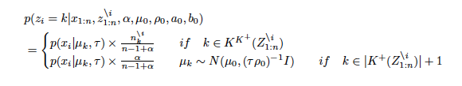
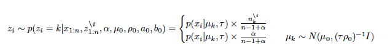
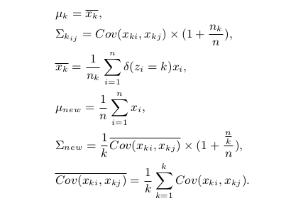
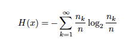
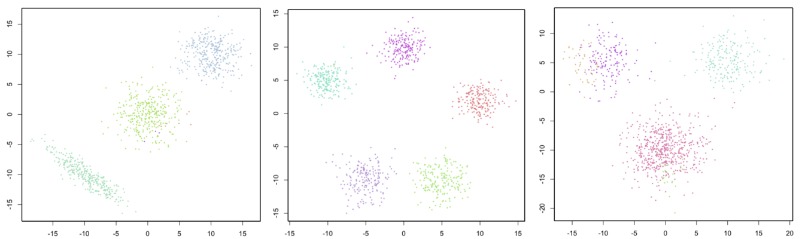

# CRPClustering: An R Package for Bayesian Nonparametric Chinese Restaurant Process Clustering with Entropy  
[](http://cran.r-project.org/package=CRPClustering)
[](http://cran.rstudio.com/web/packages/CRPClustering/index.html)
## Abstract
Clustering is a scientific method which finds the clusters of data and many related methods are traditionally researched for long terms. Bayesian nonparametrics is statistics which can treat models having infinite parameters. Chinese restaurant process is used in order to compose Dirichlet process. The clustering which uses Chinese restaurant process does not need to decide the number of clusters in advance. This algorithm automatically adjusts it. Then, this package can calculate clusters in addition to entropy as the ambiguity of clusters.

## Introduction
Clustering is a traditional method in order to find the clusters of data and many related methods are studied for several decades. The most popular method is called as K-means [@Hartigan1979]. K-means is an algorithmic way in order to search the clusters of data. However its method needs to decide the number of clusters in advance. Therefore if the data is both high dimensions and a complex, deciding the accurate number of clusters is difficult and normal Bayesian methods are too. For that reason, Bayesian nonparametric methods are gradually important as computers are faster than ever. In this package, we implemented Chinese restaurant process clustering  (CRP) [@Pitman1995]. CRP can compose infinite dimensional parameters as Dirichlet process [@Ferguson1973]. It acts like customers who sit at tables in a restaurant and has a probability to sit at a new table. As a result, Its model always automates clustering. Moreover, we added the method which calculates the entropy [@Elliott1999] of clusters into this package. It can check the ambiguity of the result. Then, we explain the clustering model and how to use it in detail. Finally, an example is plotted on a graph.

## Background
### Chinese Restaurant Process
Chinese restaurant process is a metaphor looks like customers sit at a table in Chinese restaurant. All customers except for x_i have already sat at finite tables. A new customer x_i will sit at either a table which other customers have already sat at or a new table. A new customer tends to sit at a table which has the number of customers more than other tables. A probability equation is given by    



where n^i_k denotes the number of the customers at a table k except for i and α is a concentration parameter.

### Markov Chain Monte Carlo Methods for Clustering
Markov chain Monte Carlo (MCMC) methods [@Liu1994] are algorithmic methods to sample from posterior distributions. If conditional posterior distributions are given by models, it is the best way in order to acquire parameters as posterior distributions. The algorithm for this package is given by    

Many iterations continue on below:  

i) Sampling z_i for each i (i = 1,2, ・・・,n)



ii) Sampling u_k for each k (k = 1,2, ・・・,∞)



Sigma_k is a variance-covariance matrix of k th cluster. i and j are rows and columns' number of Sigma_k. First several durations of iterations which are called as "burn in" are error ranges. For that reason, "burn in" durations are abandoned.  

### Clusters Entropy
Entropy denotes the ambiguity of clustering. As a result of a simulation, data x_i joins in a particular table. From the total numbers n_k of the particular table k at the last iteration, a probability p_k at each cluster k is calculated. The entropy equation is given by




## Installation
CRPClustering is available through GitHub (https://github.com/jirotubuyaki/CRPClustering) or CRAN (https://CRAN.R-project.org/package=CRPClustering). If download from GitHub, you can use devtools by the commands:

```
> library(devtools)
> install_github("jirotubuyaki/CRPClustering")
```

Once the packages are installed, it needs to be made accessible to the current R session by the commands:

```
> library(CRPClustering)
```

For online help facilities or the details of a particular command (such as the function crp_gibbs) you can type:

```
> help(package="CRPClustering")
```

## Methods
### Method for Chinese Restaurant Process Clustering

```
> z_result <- crp_gibbs(as.matrix(data),
                          mu=c(0,0),
                          sigma_table=14,
                          alpha=0.3,
                          ro_0=0.1,
                          burn_in=40,
                          iteration=200
                        )
```

This method calculates CRP clustering.  
Let’s arguments be:  
  ・ data : a matrix of data for clustering. row is each data i and column is dimensions of each data i.  
  ・ mu : a vector of center points of data. If data is 3 dimensions, a vector of 3 elements like "c(2,4,7)".  
  ・ sigma_table : a numeric of table position variance.  
  ・ alpha : a numeric of a CRP concentration rate.  
  ・ ro_0 : a numeric of a CRP mu change rate.  
  ・ burn_in : an iteration integer of burn in.  
  ・ iteration : an iteration integer.  
Let’s return be:  
  ・ z_result : an array denotes the number of a cluster for each data i.   

### Visualization Method

```
> crp_graph_2d(data, z_result)
```

This method exhibits a two dimensional graph for the method "crp_gibbs".  
Let’s arguments be:  
  ・ data : a matrix of data for clustering. Row is each data i and column is dimensions of each data i.  
  ・ z_result : a vector denotes the number of a cluster for each data i and it is the output of the method "crp_gibbs".  

## Example
Data is generated from normal distributions and parameters are set as mu=c(0,0), alpha=0.3, sigmatable=14, rho_0=0.1, burnin=40, iteration=200. The result is plotted on a graph and each data joins in any cluster. The graph is given by below:



　　　　　　　　　　　　　　　　　　　　　　　Figure 1. CRP clustering result

## Conclusions
Chinese restaurant process clustering was implemented and explained how to use it. Computer resources are limited. Computer processing power is the most important problem. After this, several improvements are planed. Please send suggestions and report bugs to okadaalgorithm@gmail.com.

## Acknowledgments
This activity would not have been possible without the support of my family and friends. To my family, thank you for much encouragement for me and inspiring me to follow my dreams. I am especially grateful to my parents, who supported me all aspects.  

## References
Ferguson, Thomas. 1973. “Bayesian Analysis of Some Nonparametric Problems,” Annals of Statistics. 1 (2):
209–230.  

Hartigan, M. A., J. A.; Wong. 1979. “Algorithm as 136: A K-Means Clustering Algorithm,” Journal of the Royal Statistical Society, SeriesC. 28 (1): 100–108. JSTOR 2346830.

Liu, Jun S. 1994. “The Collapsed Gibbs Sampler in Bayesian Computations with Applications to a Gene Regulation Problem,” Journal of the American Statistical Association 89 (427): 958–966.

Pitman, Jim. 1995. “Exchangeable and Partially Exchangeable Random Partitions,” Probability Theory and Related Fields 102 (2): 145–158.  

Yngvason, Elliott H. Lieb; Jakob. 1999. “The Physics and Mathematics of the Second Law of Thermodynamics,” Physics Reports Volume:310 Issue:1 1–96.  
